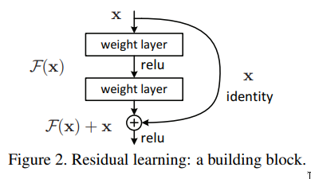
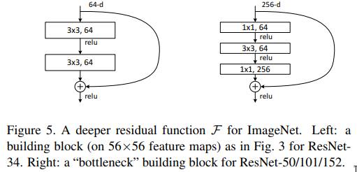
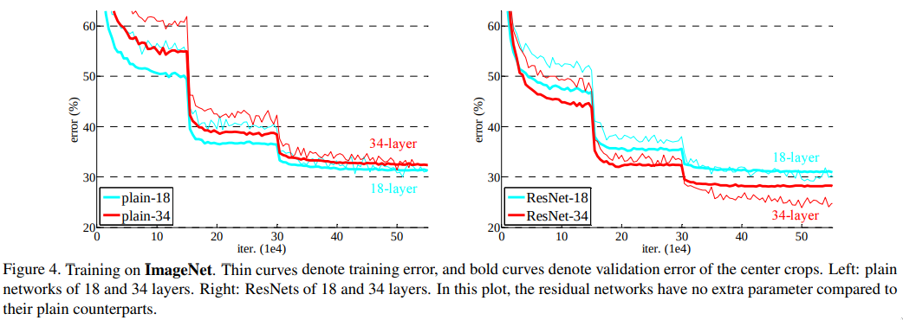
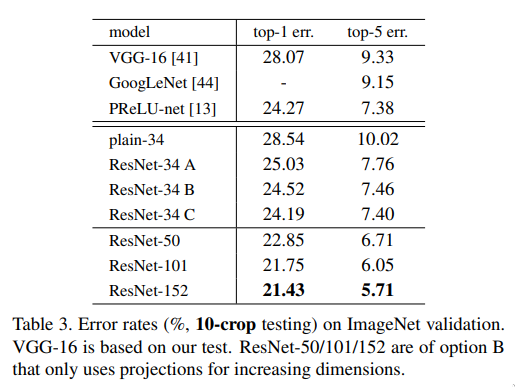

# Paper

- **Title**: Deep Residual Learning for Image Recognition
- **Authors**: Kaiming He, Xiangyu Zhang, Shaoqing Ren, Jian Sun
- **Link**: https://arxiv.org/abs/1512.03385
- **Year**: 2015

# Summary

## What

<!-- * This degradation is not caused by overfitting but rather by adding more
layers which make the model hard to optimize. -->

- They propose a residual learning framework which eases the training of deep networks.
- ResNet 8x deeper than VGGNet, with 152 layers, has significantly less parameters and performs
  better in ImageNet dataset.
- Ensemble of ResNets achieve 3.57% error on ImageNet test dataset.
- Deep networks learn more enriched low/mid/high level features as we increase
  the depth of the network.
- Recent evidence reveals that this is not the case as the training error
  increases as we increase the layers.
- This degradation is not caused by overfitting but rather by deep networks
  which are hard to optimize.
- They argue that deeper models should produce error rates no higher than their
  shallower counterpart as the
  smaller networks' solution space is a subspace of the original networks'
  solution space and the stacked layers
  should atleast learn the identity mappings.
- So instead of hoping that the network would learn the identity mappings they
  explicitly reformulate the
  original function to `F(x) + x`(skip connections), where `x` is the output of
  one of the previous layers.
- They hypothesize that it is easier to optimize the residual mapping.

 

 

## How

- Model Overview

  - They reformulate the original function `H(x) = F(x)` to `H(x) = F(x) + x` as hypothesized.
  - If the identity mappings are optimal then the network can just drive the layer weights to 0.
  - Skip connections can be used in both fully connected and convolutional layers.

 

- Model Architecture

  - Skip connections are made b/w 2 or 3 layers.
  - They don't see any improvements for 1 layer skip connections, i.e `(W * x) + x`.
  - If the dimensions of the `F(x)` and `x` don't match, then they propose a few methods to match them:
    1. Add zero padded entries for the extra dimensions(no extra parameters).
    2. Use `1x1` convolutions with matching dimensions(extra parameters).
  - Batch Normalization is used right after convolution and before activation function.
  - ImageNet model specifics:
    - Learning rate = 0.1 and is divided by 10 when the error plateaus.
    - Weight decay of 0.0001 and a momentum of 0.9.
    - He initialization is used.
    - Mini-batch of size 256.

 

- Training/Experiments

  - Models are trained on the 1.28 million training images from ImageNet which has 1000 classes.
  - They train a bunch of models with 18, 34, 50, 101, 152 layers.
  - They experiment 3 different ways to match dimensions b/w residual layers: 1. (A) Zero-padding shortcuts. 2. (B) Projection shortcuts(1x1 convs) are used for increasing dimensions. 3. (C) All shortcuts are projections.
     
    out of which (B) works the best.
  - They also explore > 1000 layer network which performs worse than their
    110 layer network, they argue that this is because of overfitting as both
    models have same training error.

 

- Results

  - They have no problem optimizing very deep networks(1000 layers).
  - Activation signals are low compared to other "plain" networks.
  - They also generalize well on other recognition tasks such as object detection.
  - The plain networks error rate goes up from 27.94% to 28.54% as the number
    of layers increased from 18 to 34 but in the case of ResNets it decreases
    from 27.88% to 25.03% for the same.

### Related Material

- Crisp and compact explanation - [ResNet Explained! - Henry AI Labs](https://youtu.be/sAzL4XMke80)
- Detailed walkthrough - [Deep Residual Learning for Image Recognition (Paper Explained) - Yannic Kilcher](https://youtu.be/GWt6Fu05voI)
- [The age old argument on where to BN](https://www.reddit.com/r/MachineLearning/comments/67gonq/d_batch_normalization_before_or_after_relu)
- [Ian Goodfellow on why BN works](https://www.quora.com/Is-there-a-theory-for-why-batch-normalization-has-a-regularizing-effect)
