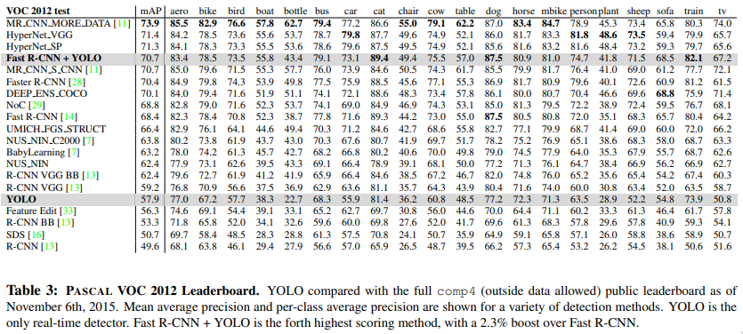

# Paper

* **Title**: You Only Look Once: Unified, Real-Time Object Detection
* **Authors**: Joseph Redmon, Santosh Divvala, Ross Girshick, Ali Farhadi
* **Link**: https://arxiv.org/abs/1506.02640
* **Code**: [pjreddie/darknet](https://github.com/pjreddie/darknet)
* **Year**: 2015

# Summary

## What

* The proposed model predicts bounding boxes on images.
* Reframes classification as a regression problem.
* Makes localization errors but faster than R-CNN, processing images at 155 FPS.
* End-to-end training, a single CNN simultaneously predicts the multiple bounding boxes and class scores for those boxes.
* Reasons globally about the image as it trains on the entire image rather than using methods like sliding window 
  which trains on local regions.

## How

* Model Overview

    * Divides image in to a `SxS` grid.
    * Each grid cell predicts `B` bounding boxes.
    * Each bounding box predicts 5 values - x, y, w, h and confidence score.
        * (x, y) coordinates represent the center of the box relative to the grid cell.
        * w, h represent the width and height of the box relative to the whole image.
        * Confidence scores are equal to zero if there is no object in the grid cell and is calculated as the IOU
          (Intersection over Union) b/w the predicted box and the ground truth otherwise.
    * Class probabilities to decide which of the `C` classes (`C` = number of labelled classes in the dataset) the object belongs to.

 

  

  

 

* Model Architecture

    * Input images are of size `448x448x3`.
    * Output are `S x S x (B*5 + C)` values.
        * `S` is the grid size, default = 7.
        * `B` is the number of predicted bounding boxes, default = 2.
        * `C` is the number of labelled classes in the dataset.
    * Predicts `B` bounding boxes per grid cell and chooses the one with highest IOU during training 
      essentially learning to predict certain objects, aspect ratios and improve overall recall.
    * They use 24 convolutional layers followed by 2 fully connected layers with some having 1x1 convs and few having 3x3 convs.
    * The Fast YOLO uses 9 conv layers and fewer filters, all other parameters are the same for those.
    * Use linear activation function for the final layer and leaky RELUs with alpha = `0.1` for the rest.
    * Use dropout with `0.5` after the first layer to prevent co-adaptation b/w layers.
    * Use momentum of `0.9` and decay of `0.0005` - pretty standard stuff.
    * Gradually increase learning rate from 10-3 to 10-2 for the first epoch and continue
      training with that till 75 epochs, then 10-3 for next 30 epochs and finally 10-4 for the rest.
    * They found that if they started with a high learning rate then the model often diverges due to unstable gradients.

 

  

 

* Training

    * They pre-train the model on ImageNet and then finetune on the Pascal VOC dataset.
    * Optimize over the sum-squared error
    * Since most grid cells do not have objects, these gradients overpower the gradients from cells with objects in
      them leading to model instability. To account for this, they weigh the bounding box loss higher than the loss
      from confidence using 2 parameters λcoord = 5 for bounding boxes and λnoobj = 0.5 for confidence.
    * Sum-squared error equally weighs errors in large and small boxes. Small deviations in large bounding boxes would have a small 
      effect than in small bounding boxes, to address this issue they predict the square root of the width and height resulting in
      similar losses for both large and small bounding boxes.
 

  

 

* Results

    * Struggles with too many small nearby objects, such as flock of birds.
    * Struggles to generalize bounding box on new unusual aspect ratio images.
    * YOLO scores a 57.9 mAP compared to 70.4 with the Faster R-CNN on the Pascal VOC 2012 dataset.
    * Pascal VOC 2012 Leaderboard
    
  

    * They achieve 45 FPS (22ms/image), compared to 7 FPS (142ms/image) with Faster R-CNN.
    * YOLO on a diverse dataset, as you can see it generalizes well on artworks too.
    
  

### Related Material

* https://pjreddie.com/darknet/yolo
* https://github.com/AlexeyAB/darknet
* https://github.com/aleju/papers/blob/master/neural-nets/YOLO.md
