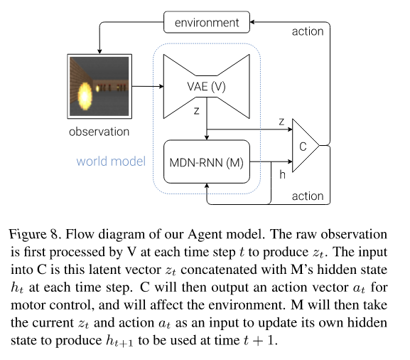

# Paper

- **Title**: World Models
- **Authors**: David Ha, Jurgen Schmidhuber
- **Link**: [https://arxiv.org/abs/1803.10122.pdf](https://arxiv.org/abs/1803.10122.pdf)
- **Year**: 2018

## What

- World model can be used to learn a compressed spatial and temporal representation of the
  environment.
- Train on "hallucinated dreams" and transfer the model back to the original environment.

## How

- ### Overview/Motivation

  - We humans develop an internal model of the world.
  - We only learn concepts and relationships and use them to represent the real world.
  - Our brain learns an abstract representation of both spatial and temporal aspects of
    information.
  - First train the world model in unsupervised manner and train the small controller model based
    off of the world model to act in the env (Note that the world model does all the heavy
    lifting and the controller just needs to act in the latent space).

 

 

- ### Agent Model

  1. Visual sensory data (VAE)
  2. Memory component (RNN + MDN)
  3. Decision making component (Controller)

  - #### VAE (V)

    - The job of the VAE is to generate an efficient latent space of the original frame.
      <!-- TODO -->
      <!-- * They mention that the image is 2D, does that mean that the model is trained on B/W images -->
      <!--   instead of color images? -->
    - Predicts `z(t)` where `z` is the latent space representation and `t` is the timestep.

  - #### RNN + MDN(M)

    - This model compresses what happens over time. so for this purpose it predicts the future.
      serves as a predictive model of the future z vectors that V is expected to produce.
    - Predicts `P(z(t+1) | a(t), z(t), h(t))`, where `z(t)` is the latent space representation
      of the current observation, `a(t)` is the action taken at timestep `t`, `h(t)` is the
      hidden state of the RNN at time `t`.
    - Note that it predicts `P(z(t+1))` instead of a deterministic `z(t+1)`. This is because
      most environments are stochastic in nature so it outputs a Probability Density
      Function(PDF).
    - They also use a temperature parameter `τ`(tau) to control
      uncertainty/entropy/randomness(whatever you want to call it) of the hidden state while
      sampling from the PDF.

       
      

      
      

       

  - #### Controller (C)

    - Intended to be as simple and light-weight as possible, this is just a single linear layer
      which maps `z(t)` and `h(t)` directly to `a(t)`. basically, `a(t) = W_c (z(t) + h(t)) + b_c`.
    - They use the Covariance-Matrix Adaptation Evolution Strategy (CMA-ES) algorithm for
      optimizing the controller network C.
    - Note that using a separate and simple Contorller allows us to swap it out (for future
      experimentation/work) quickly later, they suggest that it can also be swapped out for an
      evolution network.

 

 

## Experiments

- ### Car Racing

    <!-- Pipeline -->

  - They first train the VAE(V) by collecting 10k samples acting randomly in the environment
    and use the usual reconstruction loss(L2) to minimize loss between the original and the
    reconstructed image. (Predicts - `z(t)`)
  - They then train the RNN-MDN(M) model using the VAE(V) to predict `z(t+1)`, given the
    previous hidden state of RNN.
  - They finally train the controller(C) to control 3 continuous values - steering,
    acceleration and brake.
  - Train these models separately instead of training them in an end-to-end manner, which also
    makes sense and is more practical.
  - The wall time for training each model was just under an hour (using 1 GPU).
  - ##### Using only `z(t)`
    - The basic network scores around 632 ± 251, on par w other leaderboard models and
      adding hidden layers help the model to achieve a score of 788 ± 141.
  - ##### Using `z(t) + h(t)` - the Full World model
    - They call this the full world model, which scores around 906 ± 21.

   
  

  
  

   

- ### VizDoom

  - #### Learning inside a dream

    <!-- TODO: change wordings -->

    - If the world model is a good representation of the original game then we can train the
      controller(C) directly on the trained models instead of the actual environment and this is
      exactly what they do here. They train the model directly on the learned world model
      instead of interacting with the actual environment.
    - No explicit rewards are given here, but the cumulative reward is defined as the total
      number of timesteps the agent manages to stay alive.
    - Training the controller(C) will be done directly in the latent space and not on raw
      pixels, because there are no raw pixels here as the world model only works in the latent
      space.
    - They train with a high `τ`(tau) and transfer the model to the actual game which
      apparently performs better than the model trained with a lower `τ` value.

### Misc

- For more details on how the models are trained, the hyperparameters, etc, take a look at the
  **Appendix** section in the paper.
- I was told that the **Related Works** section is a gold mine, so you should probably take a look
  at the papers and other articles linked there.

<!-- TODO -->
<!-- be more explicit about the training pipeline -->
<!-- explain more about dreams -->
<!-- like you update the RNN with the current z(t), and ? will the recon loss be wrt to the next frame -->
